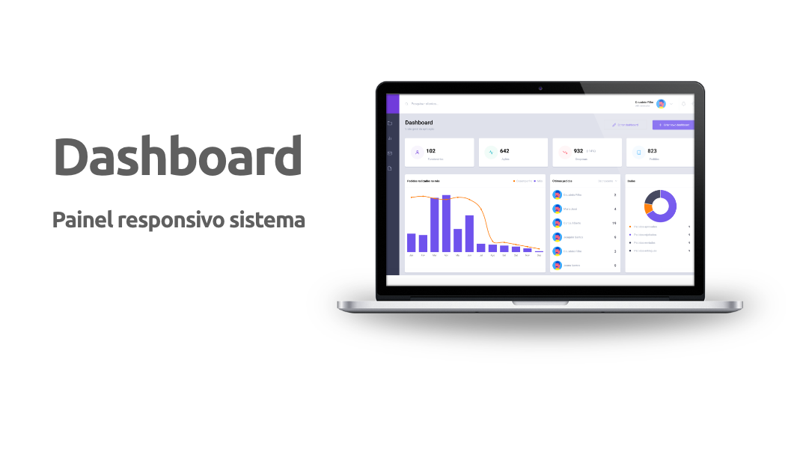

<h1 align="center">
  
 

## :bookmark: Sobre

Criando uma interface de dashboard de um sistema.

## :rocket: Tecnologias Utilizadas

O projeto foi desenvolvido utilizando as seguintes tecnologias

- React.JS
- TypeScript

## :heavy_check_mark: Resultado

<h4 align="center">
    
</h4>

<h4 align="center">
    Feito com 💜 by Deusdete Filho</a>
</h4>
